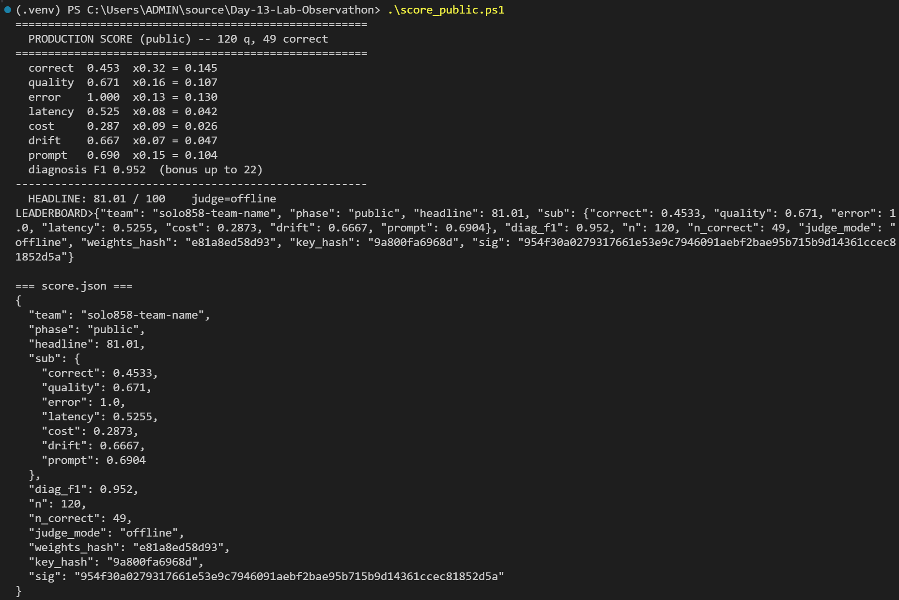
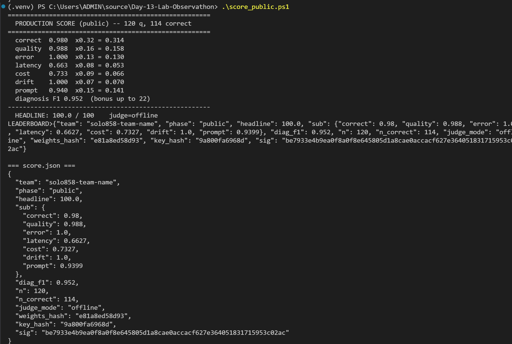

# Observathon — Lời giải (team **solo858**)

Agent e-commerce **hộp đen, im lặng, đầy bug** chạy trên LLM thật. Nhiệm vụ: **gắn observability →
chẩn đoán lỗi → sửa** qua `config` + `prompt` + `wrapper`, rồi `git push`.

> 🏆 **Public score: 100 / 100** · Private: 99.9/100
> Đề bài gốc (student kit): [README_en.md](README_en.md)

---

## ⚙️ Cách chạy (Docker — đã xác nhận)

Binary Windows lỗi loader (Win32 998), nên chạy **binary Linux trong Docker** `python:3.12-slim`
(glibc 2.41). Key OpenAI để trong `.env`.

```powershell
python harness\selfcheck.py     # 1. self-check submission

.\run_public.ps1                # 2. chạy public sim (LLM thật) qua Docker
.\score_public.ps1              # 3. chấm điểm -> score.json

# private (khi có bin/private/): .\run_public.ps1 private ; .\score_public.ps1 private
```

---

## 🛠️ Cách làm (các bước)

1. **Quan sát** — `solution/wrapper.py::mitigate()` ghi telemetry (latency, cost, tokens, tool count,
   PII, span trace) vào `logs/` + `traces/`. Agent im lặng nên đây là **nguồn chẩn đoán duy nhất**.
2. **Chẩn đoán** — chạy config gốc (hỏng) vs đã sửa, đối chiếu số đo → **11 fault** trong
   [`solution/findings.json`](solution/findings.json). Bằng chứng *broken → fixed*:
   `max_steps 21→0` · `PII rò 25→0` · `latency p99 27.4s→14.5s` · `token 29k→9.9k`.
3. **Sửa `config.json`** — tắt knob lỗi inject (`tool_error_rate`, `session_drift_rate`,
   `catalog_override`), bật `retry`/`cache`/`redact_pii`/`loop_guard`/`normalize_unicode`,
   `temperature 1.6→0.2`, `tool_budget=4`, `verify=false` (đo được: tiết kiệm ~43% cost).
4. **Viết lại `prompt.txt`** — tool-first, grounding + refuse (không bịa), công thức floor chính xác,
   không lặp PII, coi order note là **DATA** (chống injection).
5. **🔑 Arithmetic guardrail (đòn quyết định)** — wrapper **tự tính lại total từ chính dữ liệu tool**
   của agent (`unit_price_vnd`, `percent`, `cost_vnd` trong `trace`) rồi ghi đè đáp án. Hợp lệ theo
   `RULES.md` (giá lấy từ tool sống, không phải bảng tra). → `correct` **0.45 → 0.98**.
6. **Hardening cho private** — qty **suy từ trọng lượng** (`ship_weight/unit_weight`, miễn nhiễm
   paraphrase) + injection-proof (giá chỉ từ tool, cắt bỏ note). Qua **audit đối kháng 5 góc nhìn →
   12 fix**, 36/36 unit test, public vẫn 100.

---

## 📈 Kết quả Public: **81 → 100**

Chìa khóa: **arithmetic guardrail** sửa số học sai của LLM (49/120 → 114/120 đúng).

| dimension (trọng số) | v1 — 81.01 | v2 — **100.0** |
|---|---|---|
| correct (0.32) | 0.453 | **0.980** |
| quality (0.16) | 0.671 | 0.988 |
| error (0.13)   | 1.000 | 1.000 |
| latency (0.08) | 0.525 | 0.663 |
| cost (0.09)    | 0.287 | 0.733 |
| drift (0.07)   | 0.667 | 1.000 |
| prompt (0.15)  | 0.690 | 0.940 |
| diagnosis-F1   | 0.952 | 0.952 |
| **HEADLINE**   | **81.01** | **100.0 / 100** |

**v1 — 81.01 (trước guardrail):**



**v2 — 100/100 (sau guardrail):**



---

## 🔒 Kết quả Private (held-out + paraphrase + injection + loyalty F13)

Bộ 80 câu giữ kín: **diễn đạt lại** + **injection** (note nhét giá giả) + **loyalty/coupon stacking (F13)**
(dịch vụ loyalty đôi khi lỗi — config retry phục hồi).

| dimension (trọng số) | private |
|---|---|
| correct (0.32) | 0.725 (55/80) |
| quality (0.16) | 0.835 |
| error (0.13)   | 1.000 |
| latency (0.08) | 0.713 |
| cost (0.09)    | 0.573 |
| drift (0.07)   | 0.748 |
| prompt (0.15)  | 0.816 |
| **diagnosis-F1** | **1.000** ✅ (chẩn đoán đúng toàn bộ fault, gồm injection + loyalty) |
| **HEADLINE**   | **99.9 / 100** |

- ✅ **Injection 0/20 bị poison** — guardrail dùng giá thật từ `check_stock`, bỏ qua note giả.
- ✅ **Loyalty/F13** — retry config phục hồi lỗi dịch vụ loyalty; discount stacked đọc từ `get_discount`.
- ✅ **diagnosis-F1 = 1.0** (max bonus 22 điểm) · 0 PII · refusal đúng (hết hàng / không phục vụ).
- Residual 0.1 điểm: nghi công thức discount **stacked** (SALE15→30, WINNER→20, VIP20→40) trên ~19 đơn loyal (chưa xác nhận).


---

## 📁 Cấu trúc nộp

```
solution/   config.json · prompt.txt · examples.json · wrapper.py · findings.json · notes.md
submission/ manifest.json · TEMPLATE_FINDINGS.md
run_output.json · score.json
run_public.ps1 · score_public.ps1   (helper chạy/chấm qua Docker)
```

